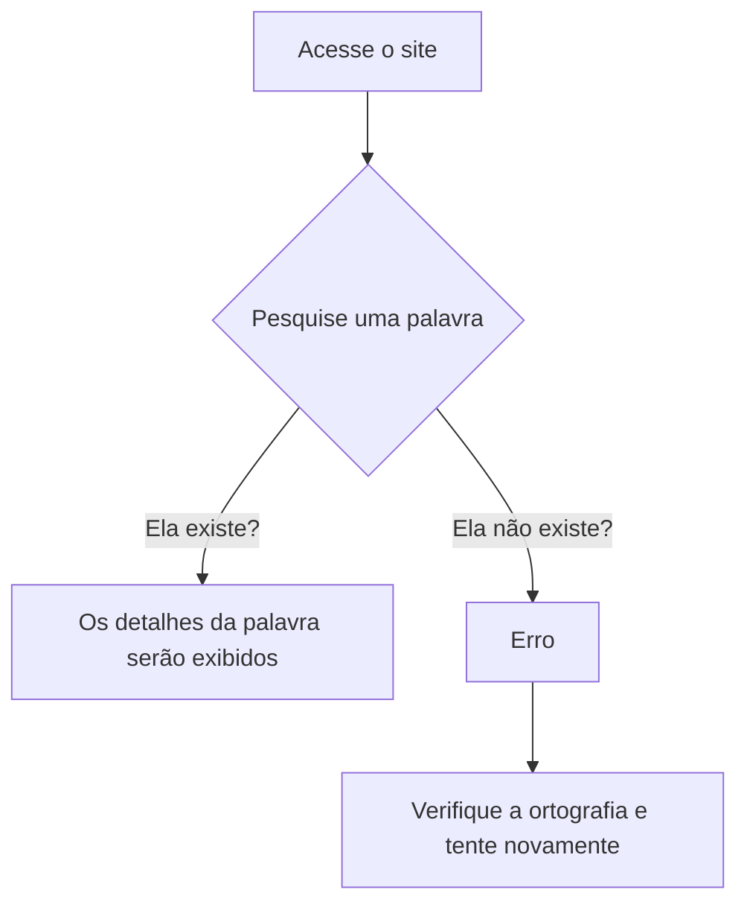

# Λngles

**Λngles** é um **dicionário inglês** totalmente online, onde o usuário consegue pesquisar por palavras da língua inglesa e visualizar seus detalhes, como:

- **Fonética**
- **Definições**
- **Exemplos**
- **Sinônimos**
- **Antônimos**
- **Classes Gramaticais**

## Como Usar?

## Exemplo 

Resultado da busca pela palavra **`yes`**:

.png)

## Fonte

|Fonte|Endpoint                                                  |
|----|----------------------------------------------------------|
|DictionaryApi| `https://api.dictionaryapi.dev/api/v2/entries/en/`| 

**Padrão de uso:**

> `https://api.dictionaryapi.dev/api/v2/entries/en/${palavra}`

## Acesse Aqui

> [Λngles](https://luizagsoaress.github.io/Angles/)
